# Cars Classification with Efficient-B0

## Dataset

<ul>
    <li>
        <strong>Dataset:</strong>
        <ul>
            <li>
                <a href="https://ai.stanford.edu/~jkrause/cars/car_dataset.html">
                    <strong>
                    Stanford Cars dataset – car196
                    </strong>
                </a>
            </li>
        </ul>
    </li>
    <li>
        <strong>Download:</strong>
        <ul>
            <li>
                <code>cd ./datasets/stanford_car_196/</code>
            </li>
            <li>
                <code>bash download.sh</code>
            </li>
        </ul>
    </li>
</ul>

# Data Preprocessing

<ul>
    <li>
        Spliting Data:
        <ul>
            <li>
                Dataset was splitted into training, validation, and testing set.
            </li>
        </ul>
    </li>
</ul>

<table style="text-align: center margin-left: auto; margin-right: auto; text-align: center" border=0 align=center>
    <thead>
        <tr>
            <th></th>
            <th># of Gropus</th>
            <th># of Data</th>
            <th># of Gray-Scale Images</th>
            <th>Average Number of Images in Each Class</th>
            <th>Median Number of Images in Each Class</th>
        </tr>
    </thead>
    <tbody>
        <tr>
            <td>Training</td>
            <td>196</td>
            <td>6598</td>
            <td>14</td>
            <td>33.66</td>
            <td>34</td>
        </tr>
        <tr>
            <td>Validation</td>
            <td>196</td>
            <td>1546</td>
            <td>4</td>
            <td>7.88</td>
            <td>8</td>
        </tr>
        <tr>
            <td>Testing</td>
            <td>196</td>
            <td>8041</td>
            <td>16</td>
            <td>41.02</td>
            <td>42</td>
        </tr>
    </tbody>
</table>

<ul>
    <li>
        Network Input:
        <ul>
            <li>
                Input Size:
                <ul>
                    <li>112 x 112</li>
                </ul>
            </li>
            <li>
                Normalized:
                <ul>
                    <li>μ = [0.455,0.460,0.471]</li>
                    <li>σ = [0.267,0.266,0.271]</li>
                </ul>
            </li>
            <li>
                Data Augmentation (Only at training step):
                <ul>
                    <li>Random Horizontal Flip</li>
                    <li>Random Rotation</li>
                </ul>
            </li>
        </ul>
    </li>
</ul>

# Network

<ul>
    <li>
        Backbone Network:
        <ul>
            <li>
                EfficientNet-B0
                <ul>
                    <li>
                        Pretrained on ImageNet
                    </li>
                </ul>
            </li>
        </ul>
    </li>
    <li>
        Output Layers and Classifier (e: embedding size):
        <ul>
            <li>
                Batch Normalization
            </li>
            <li>
                Fully-Connected (e → e/2)
            </li>
            <li>
                Dropout
            </li>
            <li>
                Fully-Connected (e/2 → e/4)
            </li>
            <li>
                Dropout
            </li>
            <li>
                Fully-Connected (e/4 → 196)
            </li>
        </ul>
    </li>
</ul>

# Optimization

<ul>
    <li>
        Loss Function:
    </li>
</ul>

$$ LabelSmoothingCrossEntropy = { (1-\epsilon) ce(i) + \epsilon \sum\_{j \ne i}{ \frac{ce(j)}{N}}} $$

<ul>
    <li>
        Optimizer:
        <ul>
            <li>
                SGD
            </li>
            <li>
                Adam
            </li>
        </ul>
    </li>
    <li>
        Learning Rate Scheduler:
        <ul>
            <li>
                Reduce Learning Rate on Plateau (torch.optim.lr_scheduler.ReduceLROnPlateau)
            </li>
        </ul>
    </li>
</ul>

<table style="text-align: center margin-left: auto; margin-right: auto; text-align: center" border=0 align=center>
    <thead>
        <tr>
            <th></th>
            <th>Mode</th>
            <th>Patience</th>
            <th>Threshold</th>
            <th>Minimum Learning Rate</th>
        </tr>
    </thead>
    <tbody>
        <tr>
            <td>LR-Scheduler Parameter</td>
            <td>Max</td>
            <td>3</td>
            <td>0.9</td>
            <td>1e-6</td>
        </tr>
    </tbody>
</table>

# Experiments (Investigating Effects of Fixing Bockbone Parameter)

In this experiment, the effect of fixing network parameters has been investigated in 3 cases:

<ul>
    <li>
        Fixing all backbone parameters (<strong>fixed</strong>)
    </li>
    <li>
        The parameters of the 6th, 7th, and 8th layer of the backbone can be trained (<strong>semi-fixed</strong>)
    </li>
    <li>
        All parameters of the backbone can be trained (<strong>unfixed</strong>)
    </li>
</ul>

# Results

<ul>
    <li>Learning Rate:</li>
</ul>

<table  style="margin-left: auto; margin-right: auto; text-align: center" border=0 align=center>
    <thead>
        <tr>
            <th>Fixed</th>
            <th>Semi-Fixed</th>
            <th>Unfixed</th>
        </tr>
    </thead>
    <tbody>
        <tr>
            <td>
                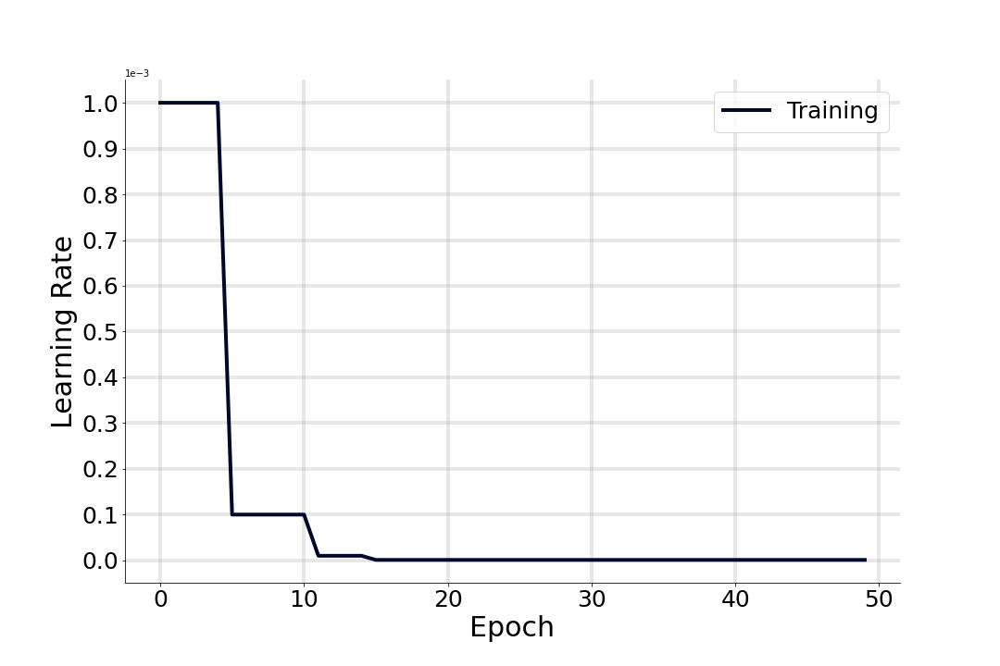
            </td>
            <td>
                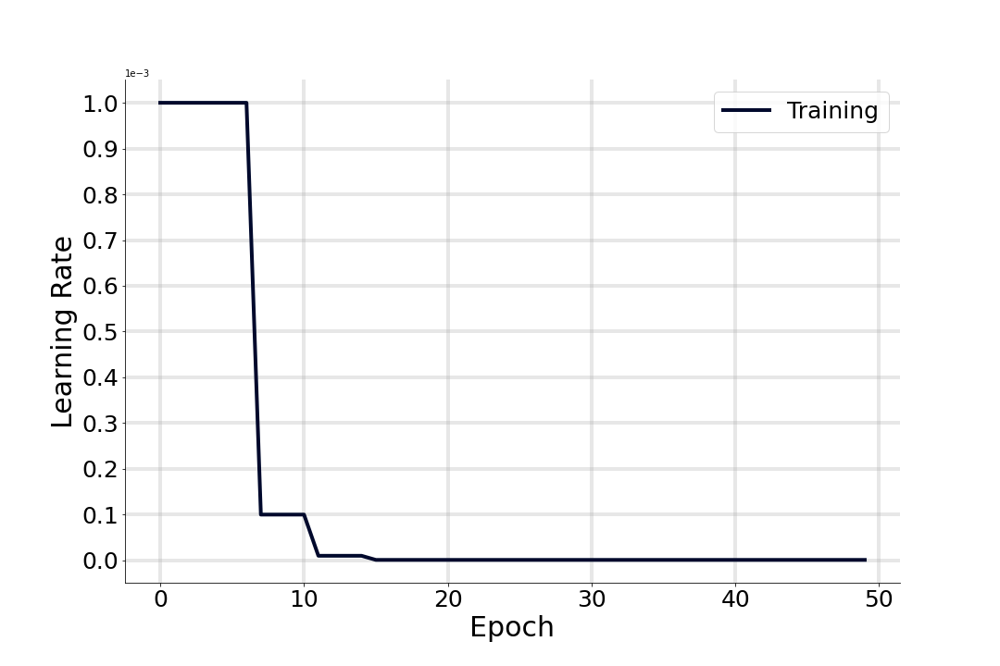
            </td>
            <td>
                
            </td>
        </tr>
    </tbody>
</table>

<ul>
    <li>Loss:</li>
</ul>

<table  style="margin-left: auto; margin-right: auto; text-align: center" border=0 align=center>
    <thead>
        <tr>
            <th>Fixed</th>
            <th>Semi-Fixed</th>
            <th>Unfixed</th>
        </tr>
    </thead>
    <tbody>
        <tr>
            <td>
                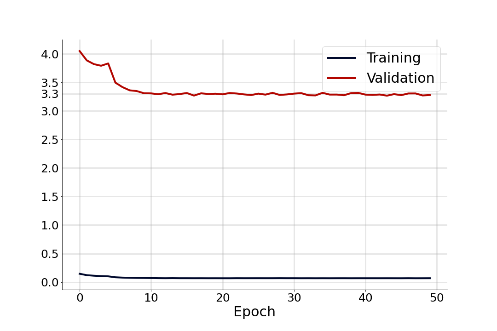
            </td>
            <td>
                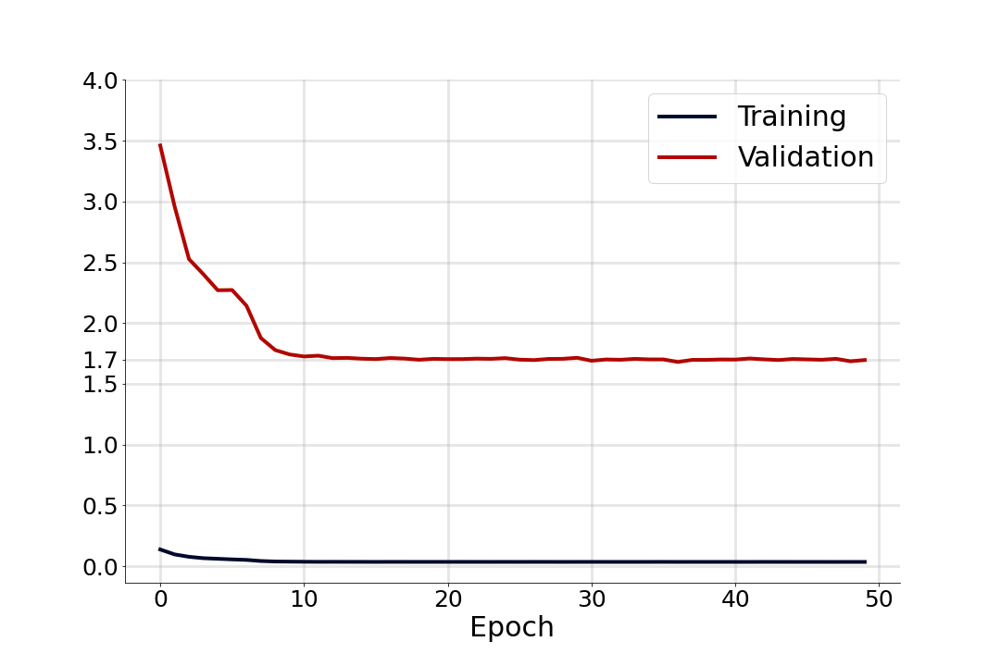
            </td>
            <td>
                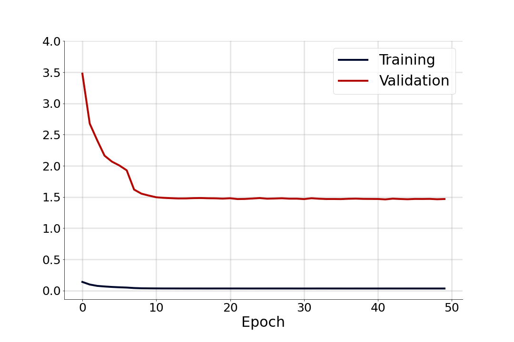
            </td>
        </tr>
    </tbody>
</table>

<ul>
    <li>Accuracy (on training and validation set):</li>
</ul>

<table style="margin-left: auto; margin-right: auto; text-align: center" border=0 align=center>
    <thead>
        <tr>
            <th>Fixed</th>
            <th>Semi-Fixed</th>
            <th>Unfixed</th>
        </tr>
    </thead>
    <tbody>
        <tr>
            <td>
                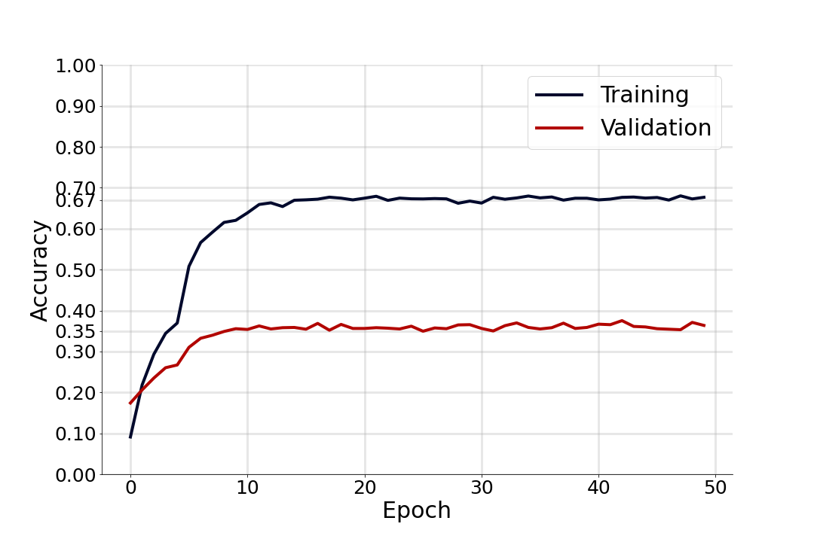
            </td>
            <td>
                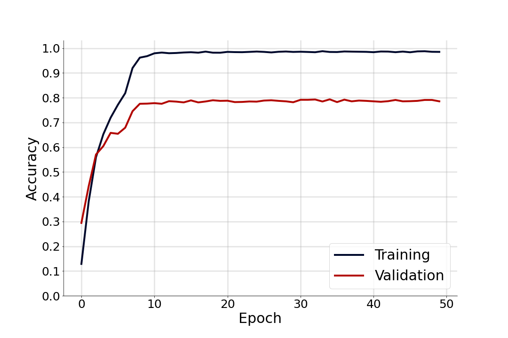
            </td>
            <td>
                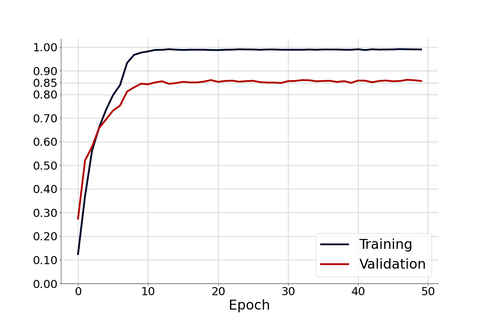
            </td>
        </tr>
    </tbody>
</table>

<ul>
    <li>Accuracy (on testing set):</li>
</ul>

<table style="margin-left: auto; margin-right: auto; text-align: center" border=0 align=center>
    <thead>
        <tr>
            <th></th>
            <th>Accuracy</th>
        </tr>
    </thead>
    <tbody>
        <tr>
            <td>
                Fixed
            </td>
            <td>
                35.28%
            </td>
        </tr>
        <tr>
            <td>
                Semi-Fixed
            </td>
            <td>
                80.04%
            </td>
        </tr>
        <tr>
            <td>
                Unfixed
            </td>
            <td>
                85.03%
            </td>
        </tr>
    </tbody>

</table>

# CNN Visualization

<table style="margin-left: auto; margin-right: auto; text-align: center" border=0 align=center>
    <thead>
        <tr>
            <th>Visualization Method</th>
            <th>Fixed</th>
            <th>Semi-Fixed</th>
            <th>Unfixed</th>
        </tr>
    </thead>
    <tbody>
        <tr>
            <td>
                <strong>Original Image</strong>
            </td>
            <td>
                
            </td>
            <td>
                
            </td>
            <td>
                
            </td>
        </tr>
        <tr>
            <td>
                <strong>Integrated Gradients</strong>
            </td>
            <td>
                
            </td>
            <td>
                
            </td>
            <td>
                
            </td>
        </tr>
        <tr>
            <td>
                <strong>Gradient Shap</strong>
            </td>
            <td>
                
            </td>
            <td>
                
            </td>
            <td>
                
            </td>
        </tr>
        <tr>
            <td>
                <strong>Deep Lift</strong>
            </td>
            <td>
                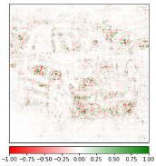
            </td>
            <td>
                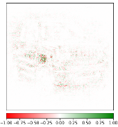
            </td>
            <td>
                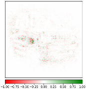
            </td>
        </tr>
        <tr>
            <td>
                <strong>Occlusion</strong>
            </td>
            <td>
                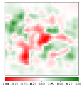
            </td>
            <td>
                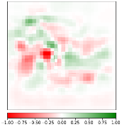
            </td>
            <td>
                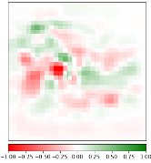
            </td>
        </tr>
    </tbody>
</table>

# How to Use

<ul>
    <li>
        Training:
        <ul>
            <li>Set hyper-parameters in train.sh</li>
            <li><code>bash train.sh</code></li>
        </ul>
    </li>
    <li>
        Evaluation:
        <ul>
            <li>Set hyper-parameters in test.sh</li>
            <li><code>bash test.sh</code></li>
        </ul>
    </li>
</ul>

# Pretrained Models

<ul>
    <li>
        <a href="https://drive.google.com/file/d/1zvHJu7IRIEeuSpRTjINe4oe-TKTzH7b7/view?usp=sharing">Fixed Experiment</a>
    </li>
    <li>
        <a href="https://drive.google.com/file/d/1Oglbv7mdvD-_Dz6GWl1IcXQpd6aPMiy0/view?usp=sharing">Semi-fixed Experiment</a>
    </li>
    <li>
        <a href="https://drive.google.com/file/d/1a0DzJbiibefi8Y50R4njI1Fsk_tRHVCM/view?usp=sharing">Unfixed Experiment</a>
    </li>
</ul>

# Report

<ul>
  <li><strong>Link:</strong>
    <ul>
      <li><a href="https://github.com/ahedayat/Cars-Classification-with-EfficientNet-B0/blob/main/Report.pdf">Persian (page: 24-32)</a></li>
    </ul>
  </li>
</ul>

# References

<ul>
    <li>
        <a href="https://arxiv.org/abs/1905.11946">EfficientNet: Rethinking Model Scaling for Convolutional Neural Networks</a>
    </li>
    <li>
        <a href="https://github.com/matkalinowski/EfficientNet-on-Stanford-Cars-Dataset">github.com/matkalinowski/EfficientNet-on-Stanford-Cars-Dataset</a>
    </li>
</ul>
